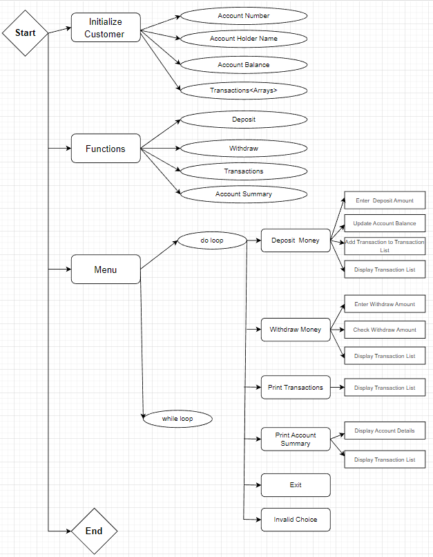

In this programme, we're developing a Java menu-driven bank account transaction programme. The account number, account holder's name, and account balance are all global variables in the programme. The client may be initialised, money can be deposited or withdrawn, transactions can be printed, and an account summary can be printed.

The user must enter the account number, name of the account holder, and account balance in order to initialise the customer. After that, the application will use this information to generate a new customer object.

The user must enter the desired deposit amount in order to make a payment. The application will record the transaction details and add this sum to the customer's account balance.

The user must input the desired withdrawal amount in order to withdraw money. If the consumer has enough money on hand to complete the transaction, the computer will verify this. If so, the computer will record the transaction information and deduct the appropriate amount from the customer's account balance. The application will indicate an error if they don't have enough balance.

The programme will show a list of every transaction the consumer has done, which may then be printed.

The application will provide the customer's account information, including account number, account holder name, account balance, and a list of transactions, when you choose to print the account summary.

Output:=
Welcome to the Bank Account program
Please enter the following details :
Account Number: 22222
Account Holder Name: vishva
Account Balance: 23000
Select from the following
1. Deposit money
2. Withdraw money
3. Print transactions
4. Account summary
5. Exit
Please enter your Choice
1
Amount to be Deposited: 2500
Amount Deposited Successfully
Select from the following
1. Deposit money
2. Withdraw money
3. Print transactions
4. Account summary
5. Exit
Please enter your Choice
3
Transactions:
Deposited: 2500.0
Select from the following
1. Deposit money
2. Withdraw money
3. Print transactions
4. Account summary
5. Exit
Please enter your Choice
3
Transactions:
Deposited: 2500.0
Select from the following
1. Deposit money
2. Withdraw money
3. Print transactions
4. Account summary
5. Exit
Please enter your Choice
3
Transactions:
Deposited: 2500.0
Select from the following
1. Deposit money
2. Withdraw money
3. Print transactions
4. Account summary
5. Exit
Please enter your Choice
4
Account Summary:
Account Number: 22222
Account Holder Name: vishva
Account Balance: 25500.0
Select from the following
1. Deposit money
2. Withdraw money
3. Print transactions
4. Account summary
5. Exit
Please enter your Choice
3
Transactions:
Deposited: 2500.0
Select from the following
1. Deposit money
2. Withdraw money
3. Print transactions
4. Account summary
5. Exit
Please enter your Choice
2
Amount to Withdraw: 230
Amount Withdrawn Successfully
Select from the following
1. Deposit money
2. Withdraw money
3. Print transactions
4. Account summary
5. Exit
Please enter your Choice
3
Transactions:
Deposited: 2500.0
Withdrawn: 230.0
Select from the following
1. Deposit money
2. Withdraw money
3. Print transactions
4. Account summary
5. Exit
Please enter your Choice
4
Account Summary:
Account Number: 22222
Account Holder Name: vishva
Account Balance: 25270.0
Select from the following
1. Deposit money
2. Withdraw money
3. Print transactions
4. Account summary
5. Exit
Please enter your Choice
5
Exit Program...

Flowchart:

